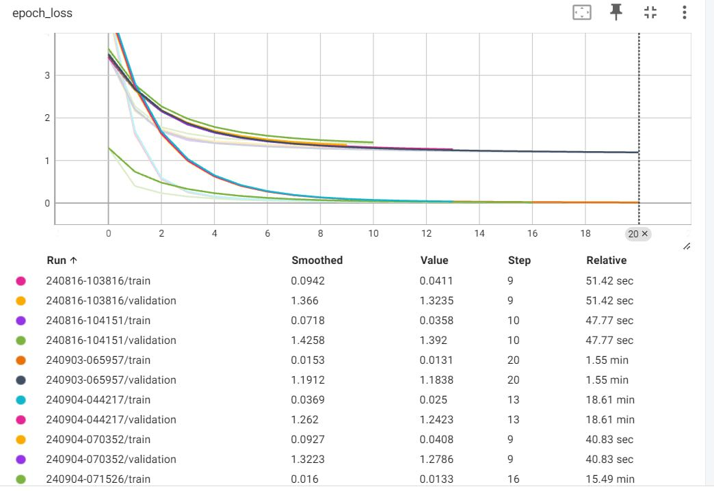
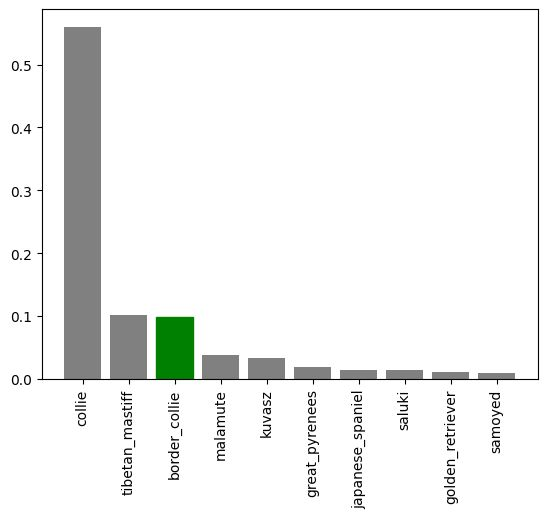
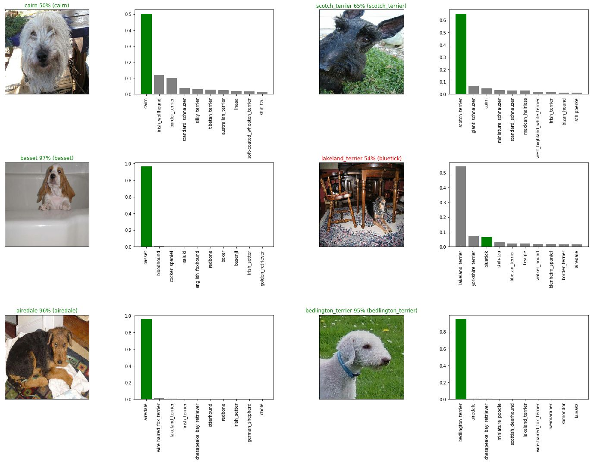

<p align="center">
    <h1 align="center">DOG-VISION</h1>
</p>
<p align="center">
    <em><code>A deep learning model which can identify 120 different breeds of dogs.</code></em>
</p>
<p align="center">
	
	
	
	
</p>
<p align="center">
		<em>Built with the tools and technologies:</em>
</p>
<p align="center">
	
</p>

<br>

#####  Table of Contents

- [ Overview](#-overview)
- [ Features](#-features)
- [ Repository Structure](#-repository-structure)
- [ Modules](#-modules)
- [Pictures](#-Pictures)
- [ Getting Started](#-getting-started)
    - [ Prerequisites](#-prerequisites)
    - [ Installation](#-installation)
    - [ Usage](#-usage)
    - [ Tests](#-tests)
- [ Project Roadmap](#-project-roadmap)
- [ Contributing](#-contributing)
- [ License](#-license)
- [ Acknowledgments](#-acknowledgments)

---

##  Overview

<code>It is a deep learning model which identifies different breeds of dogs through their images. The model has been trained to classify 120 different dog breeds using a dataset of over 10,000 images.</code>

---

##  Features

- 120 Dog Breeds Classification: The model is capable of identifying 120 different dog breeds with high accuracy.
- Pretrained Model: Uses MobileNetV2 as the base model for image feature extraction.
- Image Input: Accepts any dog image, processes it, and returns the breed probabilities.
- Transfer Learning: Implements transfer learning to fine-tune the model.

---

##  Repository Structure

```sh
└── DOG-VISION/
    ├── 20240904-06131725430414-1000-images-mobilenetv2-Adam.h5
    ├── Dog_vision.ipynb
    └── README.md
```

---

##  Modules

<details closed><summary>.</summary>

| File | Summary |
| --- | --- |
| [Dog_vision.ipynb](https://github.com/n-jul/DOG-VISION/blob/main/Dog_vision.ipynb) | <code>The notebook that contains all the code to preprocess data, train, and test the model.
</code> |

</details>

---

## Pictures
Here's a preview of the model in action:

<p align="center">    </p>

##  Getting Started

###  Prerequisites

**JupyterNotebook**: `version 7.2.2`

###  Installation

Build the project from source:

1. Clone the DOG-VISION repository:
```sh
❯ git clone https://github.com/n-jul/DOG-VISION
```

2. Navigate to the project directory:
```sh
❯ cd DOG-VISION
```

3. Install the required dependencies:
```sh
❯ pip install -r requirements.txt
```

###  Usage

To run the project, execute the following command:

```sh
❯ jupyter nbconvert --execute notebook.ipynb
```

###  Tests

Execute the test suite using the following command:

```sh
❯ pytest notebook_test.py
```

---

##  Project Roadmap

## Project Roadmap

- [x] **Task 1**: Implement image preprocessing pipeline.
- [x] **Task 2**: Train the model using MobileNetV2.
- [ ] **Task 3**: Add user interface for easier input/output of dog images.
- [ ] **Task 4**: Optimize model for faster prediction.


---

##  Contributing

Contributions are welcome! Here are several ways you can contribute:

- **[Report Issues](https://github.com/n-jul/DOG-VISION/issues)**: Submit bugs found or log feature requests for the `DOG-VISION` project.
- **[Submit Pull Requests](https://github.com/n-jul/DOG-VISION/blob/main/CONTRIBUTING.md)**: Review open PRs, and submit your own PRs.
- **[Join the Discussions](https://github.com/n-jul/DOG-VISION/discussions)**: Share your insights, provide feedback, or ask questions.

<details closed>
<summary>Contributing Guidelines</summary>

1. **Fork the Repository**: Start by forking the project repository to your github account.
2. **Clone Locally**: Clone the forked repository to your local machine using a git client.
   ```sh
   git clone https://github.com/n-jul/DOG-VISION
   ```
3. **Create a New Branch**: Always work on a new branch, giving it a descriptive name.
   ```sh
   git checkout -b new-feature-x
   ```
4. **Make Your Changes**: Develop and test your changes locally.
5. **Commit Your Changes**: Commit with a clear message describing your updates.
   ```sh
   git commit -m 'Implemented new feature x.'
   ```
6. **Push to github**: Push the changes to your forked repository.
   ```sh
   git push origin new-feature-x
   ```
7. **Submit a Pull Request**: Create a PR against the original project repository. Clearly describe the changes and their motivations.
8. **Review**: Once your PR is reviewed and approved, it will be merged into the main branch. Congratulations on your contribution!
</details>

<details closed>
<summary>Contributor Graph</summary>
<br>
<p align="left">
   <a href="https://github.com{/n-jul/DOG-VISION/}graphs/contributors">
      
   </a>
</p>
</details>

---

##  License

This project is protected under the [SELECT-A-LICENSE](https://choosealicense.com/licenses) License. For more details, refer to the [LICENSE](https://choosealicense.com/licenses/) file.

---

##  Acknowledgments

- List any resources, contributors, inspiration, etc. here.

---
